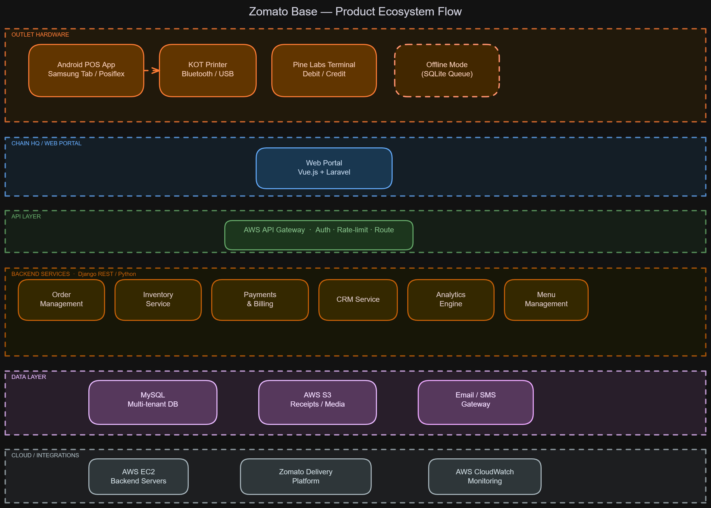
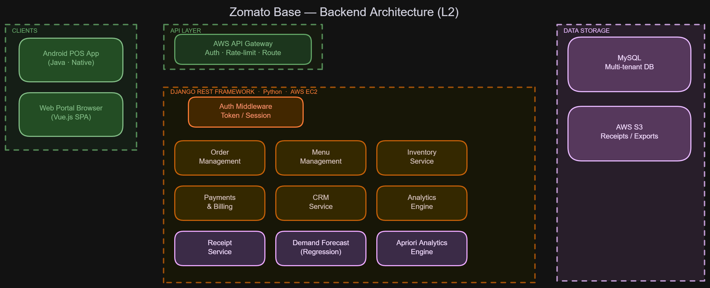
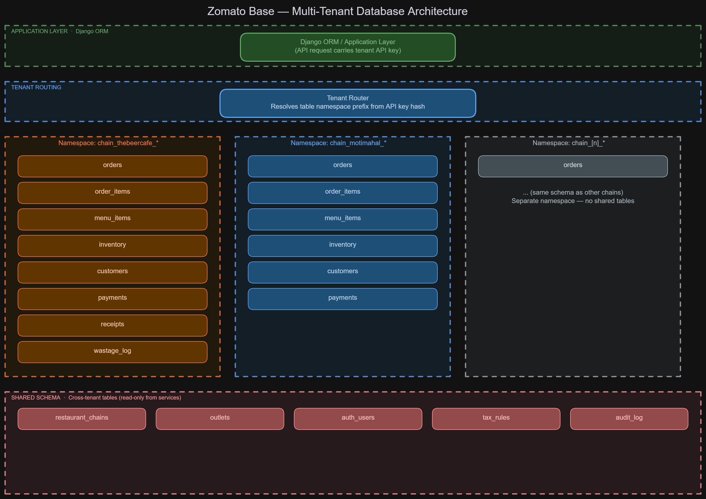
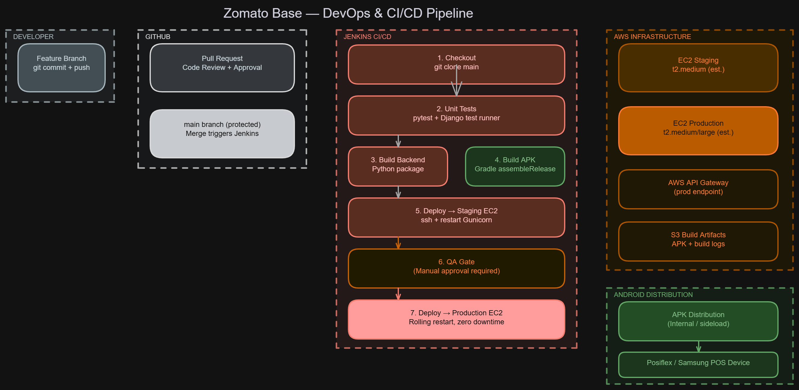

<div align="center">


# Zomato Base

### Cloud-Based Point-of-Sale System &nbsp;·&nbsp; Zomato &nbsp;·&nbsp; 2015–2016


*First role after BSc in Software Engineering &nbsp;·&nbsp; End-to-end 0→1 product build &nbsp;·&nbsp; 100+ outlet deployment*

</div>

---

## Contents

1. [Project Overview](#project-overview)
2. [Problem Statement](#problem-statement)
3. [Product Architecture](#product-architecture)
4. [My Contributions](#my-contributions)
5. [Technology Stack](#technology-stack)
6. [Functional Modules](#functional-modules)
7. [Project Timeline](#project-timeline)
8. [Data Science & Analytics](#data-science--analytics)
9. [Impact & Metrics](#impact--metrics)
10. [Challenges & Mitigations](#challenges--mitigations)
11. [Architecture Diagrams](#architecture-diagrams)
12. [Press Coverage](#press-coverage)
13. [Context & Origin Story](#context--origin-story)

---

## Project Overview

Zomato Base was a cloud-native, Android-first point-of-sale (POS) system I helped build from the ground up as a fresh graduate at Zomato in 2015. Within approximately ten months — four months of core development, two months of QA and testing, and four months of staged rollout — the system went from a proof-of-concept to active deployment at over 100 restaurant outlets, culminating in a publicly announced partnership with The Beer Cafe in April 2016 (35 outlets across 10 Indian cities).

My responsibilities spanned the entire backend: database architecture, REST API development, payment and billing services, analytics infrastructure, and AWS/DevOps contributions. I also applied data mining and predictive modelling — Apriori association rule mining and regression-based demand forecasting — to generate actionable product intelligence for restaurant operators, bridging engineering with data-driven strategy.

> *"Zomato Base aims to drive deeper engagement, greater business intelligence, and enable restaurants to offer more personalised experiences to their customers."*
>
> — **Pankaj Chaddah**, Co-Founder, Zomato *(Firstpost, April 2016)*

---

## Problem Statement

| # | Pain Point | Scope | Impact Before Zomato Base |
|---|---|---|---|
| 1 | **Fragmented, offline POS systems** | All restaurant sizes | No real-time data; manual reconciliation; downtime risk during peak service |
| 2 | **No centralised multi-outlet management** | Restaurant chains | Owners could not monitor or control all outlets remotely; required physical presence |
| 3 | **Manual inventory and wastage tracking** | Kitchen operations | Systematic over-ordering and under-ordering of raw materials; significant food waste |
| 4 | **No customer data or loyalty layer** | Front-of-house | Zero visibility into repeat customer behaviour, preferences, or visit history |
| 5 | **Disconnected delivery integration** | Zomato delivery orders | Online orders required manual re-entry into the POS — a source of errors and delays |
| 6 | **Opaque financial reconciliation** | Finance / accounting | Tax (VAT + service tax), billing, and payment reconciliation done manually or via spreadsheets |
| 7 | **No combo or upsell intelligence** | Sales and menu strategy | Staff had no data-backed guidance on popular product pairings or revenue-maximising combos |

---

## Product Architecture

Zomato Base is a three-tier system spanning outlet-level hardware, a chain-level web management portal, and a shared cloud backend.

```
┌─────────────────────────────────────────────────────────────────────────────┐
│                          RESTAURANT OUTLET                                  │
│  ┌─────────────────────┐   ┌──────────────┐   ┌──────────────────────────┐ │
│  │   Android POS App   │──▶│  KOT Printer │   │  Pine Labs Payment       │ │
│  │  Samsung Tab /      │   │  Bluetooth / │   │  Terminal (Debit/Credit)  │ │
│  │  Posiflex Terminal  │   │  USB         │   │                          │ │
│  └─────────────────────┘   └──────────────┘   └──────────────────────────┘ │
└──────────────────────────────────┬──────────────────────────────────────────┘
                                   │ HTTPS / REST
                                   ▼
┌─────────────────────────────────────────────────────────────────────────────┐
│                        AWS API GATEWAY                                      │
│              Authentication · Rate Limiting · Request Routing               │
└──────────────────────────────────┬──────────────────────────────────────────┘
                                   │
                                   ▼
┌─────────────────────────────────────────────────────────────────────────────┐
│           BACKEND  ·  Python + Django REST Framework  ·  AWS EC2            │
│                                                                             │
│  ┌──────────┐  ┌───────────┐  ┌──────────┐  ┌─────┐  ┌──────────┐  ┌────┐ │
│  │  Order   │  │ Inventory │  │ Payments │  │ CRM │  │Analytics │  │Menu│ │
│  │  Mgmt   │  │  Service  │  │& Billing │  │     │  │ Engine   │  │Svc │ │
│  └──────────┘  └───────────┘  └──────────┘  └─────┘  └──────────┘  └────┘ │
└───────────────────┬──────────────────────────────┬──────────────────────────┘
                    │                              │
          ┌─────────▼──────────┐       ┌──────────▼──────────┐
          │   MySQL Database   │       │      AWS S3          │
          │  (Multi-tenant /   │       │  Receipts · Media ·  │
          │  per-chain schema) │       │  Analytics exports   │
          └────────────────────┘       └─────────────────────┘

┌─────────────────────────────────────────────────────────────────────────────┐
│           RESTAURANT CHAIN HQ  ·  Web Portal  ·  Vue.js + Laravel          │
│            Analytics · Bulk Purchasing · Outlet Monitoring                  │
└─────────────────────────────────────────────────────────────────────────────┘

┌─────────────────────────────────────────────────────────────────────────────┐
│                       EXTERNAL INTEGRATIONS                                 │
│  Zomato Delivery Platform    ·    Email/SMS Receipt Gateway                 │
└─────────────────────────────────────────────────────────────────────────────┘
```

### Component Overview

| Component | Technology | Scope | My Involvement |
|---|---|---|---|
| **Android POS App** | Native Android (Java) | Outlet-level: orders, inventory, payments, KOT | Integration partner — web service design |
| **KOT Printer** | Bluetooth / USB driver | Kitchen Order Ticket printing at outlet | API spec and service layer |
| **Pine Labs Terminal** | Pine Labs POS SDK | Debit / credit card acceptance | **Payment service owner** |
| **Web Portal** | Vue.js + Laravel (PHP) | Chain-level analytics, bulk operations, monitoring | Analytics and reporting modules |
| **REST API** | Python + Django REST Framework | All client-facing services | **Primary owner** |
| **Database** | MySQL | Multi-tenant per restaurant chain | **Architecture owner** |
| **Cloud** | AWS (EC2, S3, API Gateway) | Hosting, storage, request routing | **Contributor** |
| **CI/CD** | GitHub + Jenkins | Build, test, and deploy pipeline | **Contributor** |

---

## My Contributions

| # | Area | Description | Ownership |
|---|---|---|---|
| 1 | **Database Architecture** | Designed the complete multi-tenant schema — separate table namespaces per restaurant chain covering orders, menus, inventory, customers, payments, and audit logs. Defined all entity relationships and indexing strategies. | **Sole owner** |
| 2 | **Backend Stack Setup** | Bootstrapped the entire Django project from scratch: project structure, settings per environment, URL routing, middleware stack, authentication, logging, and error handling conventions. | **Sole owner** |
| 3 | **REST API Development** | Built and released all REST APIs consumed by the Android team and the web portal. Collaborated closely with the Android and product teams on web service contracts and versioning. | **Primary owner** |
| 4 | **Payments, Billing & Tax Service** | Designed and implemented all payment, finance, tax, and billing services end-to-end — including Pine Labs SDK integration, India tax computation (VAT + service tax era with item-level rules), invoice generation, digital receipt dispatch (email/SMS), and payment reconciliation. | **Sole owner** |
| 5 | **Analytics & Reporting** | Developed the reporting and analytics component of the web portal: outlet-level real-time dashboards, sales trend visualisation, inventory reports, customer analytics, and chain-level consolidated views. | **Primary owner** |
| 6 | **Inventory Management APIs** | Built raw material tracking, wastage logging, stock level monitoring, reorder alerting, and recipe-based auto-deduction APIs used by both the Android app and the web portal. | **Primary owner** |
| 7 | **CRM Service** | Built customer profile management, visit history, preferences, birthday/anniversary tracking, and loyalty-related backend services. | **Contributor** |
| 8 | **Data Science — Apriori** | Implemented Apriori association rule mining on restaurant transaction data. Identified frequently co-purchased product pairs to drive upsell recommendations and menu bundling strategy. | **Sole owner** |
| 9 | **Data Science — Demand Forecasting** | Built a regression-based model to predict daily and weekly sales volumes per item. Outputs fed directly into the Inventory module's reorder planner to enable efficient raw material pre-ordering. | **Sole owner** |
| 10 | **DevOps & AWS** | Contributed to EC2 instance provisioning, environment configuration, S3 bucket setup, API Gateway configuration, and the Jenkins CI/CD pipeline for backend deployments and Android build automation. | **Contributor** |

---

## Technology Stack

| Layer | Technology | Est. Version | Purpose | Badge |
|---|---|---|---|---|
| **Mobile** | Android (Java) | API Level 21+ (Android 5.0 Lollipop) | Outlet-facing POS application |  |
| **Backend Language** | Python | 2.7 / 3.4 | REST API services |  |
| **Backend Framework** | Django + Django REST Framework | Django 1.8 LTS / DRF 3.x | API routing, ORM, authentication |  |
| **Web Frontend** | Vue.js | 1.x (released Oct 2015) | Chain management portal SPA |  |
| **Web Backend** | Laravel (PHP) | 5.1 LTS | Portal API layer and server routing |  |
| **Database** | MySQL | 5.6 / 5.7 | Primary relational store, multi-tenant |  |
| **Cloud Compute** | AWS EC2 | — | Backend API hosting |  |
| **Cloud Storage** | AWS S3 | — | Receipts, media, analytics exports |  |
| **API Routing** | AWS API Gateway | — | Client entry point, auth, rate limiting |  |
| **Version Control** | GitHub | — | Source control, pull request workflow |  |
| **CI/CD** | Jenkins | 1.x | Build, test, and deploy pipeline |  |
| **Payment Hardware** | Pine Labs Terminal | — | Card acceptance at restaurant outlet | — |
| **Print Hardware** | KOT Printer (Bluetooth/USB) | — | Kitchen Order Tickets | — |
| **POS Hardware** | Samsung Galaxy Tab / Posiflex | — | Outlet-facing touchscreen terminal | — |

> 🔶 Version numbers are estimated based on release dates and project timeline.

---

## Functional Modules

| Module | Description | Client Surface | Key Capabilities |
|---|---|---|---|
| **Order Management** | Real-time order creation, modification, status tracking, table assignment, and bill generation | Android App | Create order, update status, void item, split bill, table map |
| **Menu Management** | Dynamic item listings, categories, pricing, availability toggles, and remote push from chain HQ | Android App + Web Portal | Sync menus across outlets instantly; push price changes remotely |
| **Inventory Management** | Raw material stock tracking, wastage logging, stock level alerts, and recipe-based auto-deduction on sale | Android App + Web Portal | Deduct stock on sale, log waste events, alert on low stock threshold |
| **Recipe Management** | Link menu items to raw material bills of material (BOM) | Web Portal | Auto-deduct raw materials when items are sold |
| **Payments & Billing** | Accept debit/credit via Pine Labs; generate digital receipts; compute multi-rate tax | Android App | Pine Labs integration, VAT + service tax computation, invoice gen, email/SMS receipt |
| **CRM** | Customer profile management, order history, visit frequency, preferences, birthday/anniversary | Android App + Web Portal | Lookup customer, log preference, track repeat visits, loyalty signals |
| **Analytics & Reporting** | Real-time and historical dashboards — item-level, outlet-level, and chain-level aggregated views | Web Portal | Daily/weekly/monthly reports, top sellers, peak hours, inventory burn rates |
| **Offline Support** | Queue and sync transactions when network is unavailable | Android App | Local SQLite store, sync on reconnect, conflict resolution |
| **Electronic Receipts** | Email and SMS receipt delivery to customers on transaction completion | Android App | Triggered on payment; formatted HTML/text receipt |
| **Apriori Analytics Engine** | Association rule mining on historical transaction data to surface product combination insights | Internal (Analytics module) | Batch job on sales data; results surfaced in analytics portal |
| **Demand Forecasting** | Regression-based model to predict item-level sales volumes for raw material pre-ordering | Web Portal | 7–14 day item forecast; feeds into inventory reorder planner |

---

## Project Timeline

| Phase | Period (est.) | Duration | Milestones |
|---|---|---|---|
| **Acquisition & Kick-off** | April 2015 | — | Zomato acquires MapleGraph / MaplePOS; team assembled; product scope defined |
| **Core Development** | May – August 2015 | ~4 months | DB schema finalised, Django stack bootstrapped, all REST APIs released, Pine Labs integrated, web portal v1 delivered |
| **QA & Testing** | September – October 2015 | ~2 months | Internal testing, pilot deployment at Chai Thela, system hardening, bug fixes, offline mode validation |
| **Staged Rollout** | November 2015 – February 2016 | ~4 months | Moti Mahal live; early adopter chains onboarded; 100+ outlet milestone reached |
| **Public Launch** | April 4, 2016 | — | Official press launch; The Beer Cafe goes fully live on Zomato Base across all 35 outlets in 10 cities |

> 🔶 Timeline reconstructed from press records and direct recollection. Individual month boundaries are estimates.

---

## Data Science & Analytics

Beyond infrastructure, I used data mining and machine learning techniques to generate unique selling points for Zomato Base — converting raw transaction logs into product intelligence.

### Apriori — Association Rule Mining

| Attribute | Detail |
|---|---|
| **Algorithm** | Apriori (market basket analysis) |
| **Data source** | Historical restaurant transaction records (order–item pairs from pilot clients) |
| **Output** | Frequent itemsets + association rules with support, confidence, and lift metrics |
| **Business use** | Identify popular product pairings; recommend combo deals; optimise menu bundling and promotions |
| **Standout insight** | At **The Beer Cafe** — despite the brand being built around beer — the highest-lift association was **Old Monk Rum → Stadium Style Nachos**. This counter-intuitive finding enabled the chain to design a targeted combo promotion around a product pair that customers were already ordering together, without staff guidance. |
| **Broader use** | Results surfaced in the web portal's analytics section so any client chain could view their own top combos and customer segment affinities |

### Regression-Based Demand Forecasting

| Attribute | Detail |
|---|---|
| **Algorithm** | Regression (linear / polynomial basis) |
| **Target variable** | Daily and weekly item-level sales volume |
| **Feature inputs** | Day of week, week of year, historical sales trend, promotional flags |
| **Output** | Per-item predicted demand for the next 7–14 days |
| **Business use** | Pre-order raw materials efficiently; reduce over-ordering and food waste |
| **Module integration** | Forecast output fed directly into the Inventory module's reorder planner; restaurant managers received recommended purchase quantities |

---

## Impact & Metrics

| Metric | Value | Confidence |
|---|---|---|
| **Total outlet deployments** | ~100+ outlets | ✅ Stated in career documentation |
| **Time from kick-off to first pilot** | ~6 months | ✅ Timeline reconstructed from press and recollection |
| **Time to working prototype** | ~4 months | ✅ Direct recollection |
| **Public launch client (Beer Cafe)** | 35 outlets, 10 Indian cities | ✅ Verified — Firstpost + MediaNama, April 4, 2016 |
| **Pilot clients** | Chai Thela, Moti Mahal | ✅ Direct recollection |
| **Feature set at launch** | Menu, Inventory, Recipe, CRM, Payments, Analytics, Offline mode, Electronic receipts | ✅ Verified via press |
| **Hardware supported** | Samsung Galaxy Tab, Posiflex POS terminal, Pine Labs payment terminal | ✅ Direct recollection |
| **Zomato restaurant partner base (context)** | 60,000+ in India at the time | ✅ Verified — Reuters, April 2015 |

---

## Challenges & Mitigations

| # | Challenge | Context | How I Addressed It |
|---|---|---|---|
| 1 | **Offline-first reliability** | Restaurant internet in India (2015) was unreliable; POS downtime during a dinner rush meant lost revenue and angry customers | Android app used a local SQLite queue; transactions were processed locally and synced to backend on reconnect; server-side conflict resolution handled duplicates |
| 2 | **Multi-tenant data isolation** | A single database serving multiple restaurant chains; a bug or query mistake could expose one chain's data to another | Implemented separate table namespaces (prefixed schemas) per tenant; tenant identity enforced at API middleware — no cross-tenant foreign keys by design |
| 3 | **Real-time tax compliance** | India's 2015 tax regime involved VAT + service tax with state-specific rates and item-level exceptions (e.g. packaged vs. cooked food) | Parameterised tax rules stored per restaurant and outlet; computed server-side at order finalisation; receipts included itemised tax breakdown |
| 4 | **Payment terminal integration** | Pine Labs SDK integration required hardware-level testing at actual outlet devices; documentation was limited | Worked closely with the Pine Labs technical team; built an abstraction layer above the SDK so the payment method could be swapped without changing business logic |
| 5 | **Rapid scale: 0 to 100 outlets** | Fast rollout with a small operations team; every outlet had a unique menu configuration | Designed a templated onboarding system with bulk menu import via the web portal; remote configuration push so HQ could configure a new outlet without on-site visits |
| 6 | **Cold-start for analytics models** | New restaurant clients had no historical transaction data for Apriori or the forecast model | Minimum transaction volume threshold before surfacing insights; fallback to category-level aggregates for new outlets; model re-evaluated periodically as data accumulated |
| 7 | **Android version fragmentation** | Posiflex terminals and Samsung tablets ran different Android versions with varying Bluetooth and USB driver support | Maintained a minimum SDK target of API Level 21 (Android 5.0); abstracted all hardware interactions behind a driver interface layer |

---

## Architecture Diagrams

> Open `.excalidraw` files at [excalidraw.com](https://excalidraw.com) (File → Open) for the fully interactive version. Mermaid `.md` files render natively in GitHub.

| # | Diagram | Files | What It Shows |
|---|---|---|---|
| 1 | **Product Ecosystem Flow** | [excalidraw](diagrams/01-product-ecosystem-flow.excalidraw) · [mermaid](diagrams/01-product-ecosystem-flow.md) | End-to-end view: hardware → app → API Gateway → backend services → data layer → external integrations |
| 2 | **Backend Architecture** | [excalidraw](diagrams/02-backend-structure.excalidraw) · [mermaid](diagrams/02-backend-structure.md) | L2 backend detail: API Gateway → Django service modules → MySQL + S3 |
| 3 | **Multi-Tenant Database** | [excalidraw](diagrams/03-multi-tenant-database.excalidraw) · [mermaid](diagrams/03-multi-tenant-database.md) | Tenant isolation model: separate table namespaces per restaurant chain + shared schema |
| 4 | **DevOps & CI/CD Pipeline** | [excalidraw](diagrams/04-devops-ci-cd.excalidraw) · [mermaid](diagrams/04-devops-ci-cd.md) | GitHub branch strategy → Jenkins stages → EC2 deploy + Android APK distribution |

### Diagram 1 — Product Ecosystem Flow



### Diagram 2 — Backend Architecture



### Diagram 3 — Multi-Tenant Database



### Diagram 4 — DevOps & CI/CD Pipeline



---

## Press Coverage

| Source | Date | Headline | Link |
|---|---|---|---|
| **Reuters / Yahoo News** | April 14, 2015 | *"Indian dining app Zomato moves beyond reviews with Maple deal"* | [Link](https://www.yahoo.com/news/indian-dining-app-zomato-moves-110621559.html) |
| **YourStory** | April 2015 | *"Zomato acquires MapleGraph, launches Zomato Base"* | [Link](https://yourstory.com/2015/04/zomato-acquires-maplegraph-launches-zomato-base) |
| **Economic Times Retail** | September 22, 2015 | *"Zomato to launch marketplace for food solutions"* | [Link](https://retail.economictimes.indiatimes.com/news/food-entertainment/food-services/zomato-to-launch-marketplace-for-food-solutions/49054232) |
| **Firstpost** | April 4, 2016 | *"Zomato launches Zomato Base, cloud-based POS for restaurants"* | [Link](https://www.firstpost.com/business/zomato-launches-zomato-base-cloud-based-pos-for-restaurants-2710702.html) |
| **MediaNama** | April 4, 2016 | *"Zomato launches Android-based point of sale solution"* | [Link](https://www.medianama.com/2016/04/223-zomato-base-launch/) |

### Notable Verified Quotes

| Quote | Speaker | Source |
|---|---|---|
| *"By seamlessly integrating operational solutions such as menu management and remote inventory management into a single system, Zomato Base will make our day-to-day functioning incredibly efficient."* | **Rahul Singh**, Founder & CEO, The Beer Cafe | Firstpost, April 2016 |
| *"Zomato Base aims to drive deeper engagement, greater business intelligence, and enable restaurants to offer more personalised experiences to their customers."* | **Pankaj Chaddah**, Co-Founder, Zomato | Firstpost, April 2016 |
| *"Absolutely everything you need to run a restaurant."* | **Surobhi Das**, COO, Zomato | Economic Times, Sept 2015 |
| *"We are getting into table reservations and online ordering, so you need a very strong hold into the tech that our users need."* | **Deepinder Goyal**, CEO, Zomato | Reuters, April 2015 |

---

## Context & Origin Story

| Fact | Detail |
|---|---|
| **Employer** | Zomato Media Pvt. Ltd., Gurugram, India |
| **My background** | Joined Zomato directly after completing a Bachelor of Science in Software Engineering |
| **Acquisition trigger** | Zomato acquired MapleGraph / MaplePOS in April 2015 — a minimalistic POS originally deployed at Select City Walk food court — as the seed for a full restaurant-grade POS suite |
| **Strategic vision** | Build an end-to-end cloud POS deeply integrated with Zomato Delivery, Zomato Book (table reservations), and restaurant discovery |
| **Market gap** | The majority of restaurant POS software in India (2015) was on-premise and fragmented; large multi-outlet chain operators had no centralised, real-time visibility across their entire estate |
| **Zomato COO framing** | *"Absolutely everything you need to run a restaurant"* — Surobhi Das, COO, Zomato *(Economic Times, Sept 2015)* |
| **CEO rationale** | *"We are getting into table reservations and online ordering, so you need a very strong hold into the tech that our users need."* — Deepinder Goyal, CEO *(Reuters, April 2015)* |

---

*This document was prepared in 2026 as a retrospective portfolio artefact summarising work performed at Zomato in 2015–2016.*
