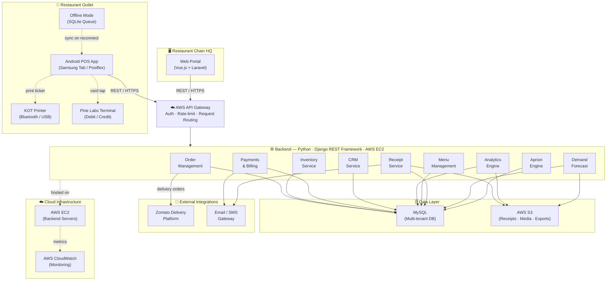

# Diagram 1 — Product Ecosystem Flow

> **Excalidraw version:** [01-product-ecosystem-flow.excalidraw](01-product-ecosystem-flow.excalidraw) · Open at [excalidraw.com](https://excalidraw.com) for interactive editing.

---

### Layer Reference

| Layer | Components | Technology |
|---|---|---|
| **Outlet Hardware** | Android POS App, KOT Printer, Pine Labs Terminal | Android Java, Bluetooth/USB, Pine Labs SDK |
| **Chain HQ Web** | Web Portal | Vue.js, Laravel (PHP) |
| **API Gateway** | AWS API Gateway | AWS — auth, rate-limiting, routing |
| **Backend Services** | 9 Django service modules | Python, Django REST Framework, AWS EC2 |
| **Data Layer** | MySQL (multi-tenant), AWS S3 | MySQL 5.6/5.7, AWS S3 |
| **External Integrations** | Zomato Delivery, Email/SMS | REST integrations |
| **Cloud Infra** | AWS EC2, CloudWatch | AWS |
