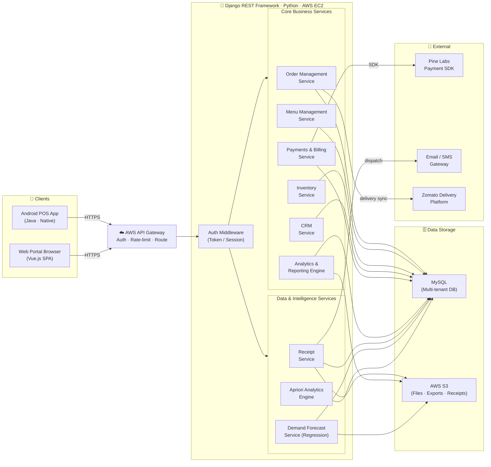

# Diagram 2 — Backend Architecture (L2)

> **Excalidraw version:** [02-backend-structure.excalidraw](02-backend-structure.excalidraw) · Open at [excalidraw.com](https://excalidraw.com) for interactive editing.

---

### Service Module Reference

| Service | Responsibility | Storage | I/O |
|---|---|---|---|
| **Order Management** | Create, update, track, void orders; table management | MySQL | Android App ↔ API |
| **Menu Management** | Item listings, pricing, availability, remote push | MySQL | Android + Web Portal |
| **Inventory Service** | Raw material stock, wastage log, reorder alerts, recipe BOM deduction | MySQL | Android + Web Portal |
| **Payments & Billing** | Pine Labs SDK, tax computation, invoice generation, reconciliation | MySQL | Android + Pine Labs SDK |
| **CRM Service** | Customer profiles, visit history, preferences, loyalty | MySQL | Android + Web Portal |
| **Analytics Engine** | Real-time dashboards, sales trends, top-sellers, chain roll-up | MySQL + S3 | Web Portal |
| **Receipt Service** | Email/SMS receipt generation and dispatch | MySQL + S3 | Triggered by Payments |
| **Demand Forecast** | Regression-based 7–14 day item sales prediction | MySQL + S3 | Web Portal / Scheduler |
| **Apriori Engine** | Association rule mining on historical transactions | MySQL | Batch / Web Portal |
