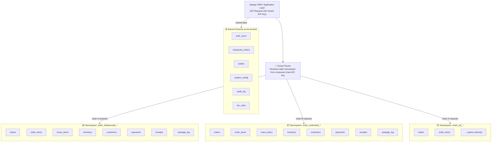

# Diagram 3 — Multi-Tenant Database Architecture

> **Excalidraw version:** [03-multi-tenant-database.excalidraw](03-multi-tenant-database.excalidraw) · Open at [excalidraw.com](https://excalidraw.com) for interactive editing.

---

### Table Schema Reference

**Per-tenant tables** (prefixed with `chain_{slug}_`):

| Table | Key Columns | Notes |
|---|---|---|
| `orders` | `order_id`, `outlet_id`, `staff_id`, `table_no`, `status`, `total`, `created_at` | Central order record |
| `order_items` | `order_item_id`, `order_id`, `menu_item_id`, `quantity`, `unit_price`, `discount` | Line items per order |
| `menu_items` | `menu_item_id`, `name`, `category`, `price`, `is_available`, `recipe_id` | Outlet-level menu |
| `inventory` | `inventory_id`, `raw_material_id`, `quantity_on_hand`, `reorder_level`, `unit` | Raw material stock |
| `customers` | `customer_id`, `name`, `phone`, `email`, `dob`, `preferences`, `visit_count` | CRM profile |
| `payments` | `payment_id`, `order_id`, `amount`, `tax_amount`, `method`, `terminal_ref`, `status` | Payment record |
| `receipts` | `receipt_id`, `order_id`, `customer_id`, `email_sent`, `sms_sent`, `receipt_url` | Digital receipt |
| `wastage_log` | `log_id`, `raw_material_id`, `quantity_wasted`, `reason`, `logged_by`, `date` | Waste management |

**Shared schema tables** (no tenant prefix):

| Table | Key Columns | Notes |
|---|---|---|
| `restaurant_chains` | `chain_id`, `name`, `slug`, `api_key_hash`, `subscription_tier` | Tenant registry |
| `outlets` | `outlet_id`, `chain_id`, `name`, `city`, `address`, `timezone` | Physical locations |
| `auth_users` | `user_id`, `chain_id`, `outlet_id`, `role`, `password_hash`, `last_login` | Staff auth |
| `system_config` | `config_key`, `config_value`, `chain_id` | Per-chain configuration |
| `tax_rules` | `rule_id`, `state`, `category`, `vat_rate`, `service_tax_rate` | India tax compliance |
| `audit_log` | `log_id`, `user_id`, `action`, `table_name`, `record_id`, `timestamp` | Change audit trail |

### Tenant Isolation Guarantees

| Rule | Enforcement Point |
|---|---|
| No cross-tenant foreign keys exist | Database schema design |
| Tenant namespace resolved before every query | API middleware — reads API key from request headers |
| API key stored as hash (not plaintext) | `restaurant_chains.api_key_hash` |
| All schema changes run through migration per-tenant | Django migration tooling |
| Audit log captures all write operations | Application-level logging middleware |
