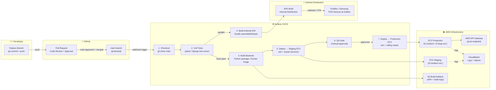

# Diagram 4 — DevOps & CI/CD Pipeline

> **Excalidraw version:** [04-devops-ci-cd.excalidraw](04-devops-ci-cd.excalidraw) · Open at [excalidraw.com](https://excalidraw.com) for interactive editing.



---

### Pipeline Stage Reference

| Stage | Tool | Description | Gate |
|---|---|---|---|
| **Feature branch** | Git / GitHub | Developer commits on a named feature branch | — |
| **Pull Request** | GitHub PRs | Code review; at least 1 approval required | Manual review |
| **Merge to main** | GitHub | Merge into protected main branch; triggers Jenkins via webhook | PR approval |
| **Checkout** | Jenkins | Jenkins clones latest main at job start | Automatic |
| **Unit Tests** | pytest + Django test runner | Runs all unit and integration tests | Auto-fail on any test failure |
| **Build Backend** | Python / pip | Packages the Django application for deployment | Passes if tests pass |
| **Build Android APK** | Gradle (`assembleRelease`) | Builds signed APK for POS devices | Runs in parallel with backend build |
| **Deploy → Staging** | SSH + shell script | Copies build to staging EC2; restarts Gunicorn | Automatic post-build |
| **QA Gate** | Manual | QA engineer or senior engineer manually approves staging | Manual approval in Jenkins UI |
| **Deploy → Production** | SSH + rolling restart | Deploys to production EC2 with zero-downtime restart | Triggered by QA approval |
| **APK Distribution** | Internal / sideload | APK pushed to build store; installed on outlet POS devices | Manual for initial rollout |
| **Monitoring** | AWS CloudWatch | Both staging and prod EC2 instances push logs and metrics | Continuous |

### Branch Strategy

```
main (protected)
  └── feature/order-api
  └── feature/payment-service
  └── feature/analytics-portal
  └── fix/offline-sync-bug
  └── chore/db-migration-v2
```

> All feature branches are short-lived. Merges to `main` trigger the full Jenkins pipeline automatically via GitHub webhook. No direct pushes to `main`.
